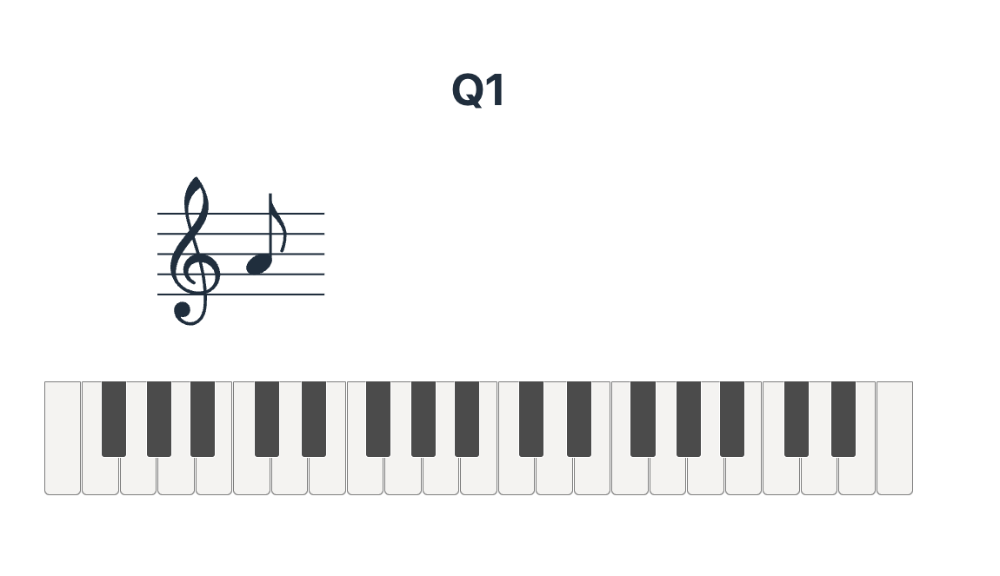

# Musical Notes Quiz
## 概要
このアプリは、五線譜に表示された音符を当てるゲームです。
ゲームが始まったら音符が一つ表示されます。
画面下部に表示されているキーボードから対応する鍵盤を押すと正誤判定の画面が表示されます。



## How to Use
localで起動させるためには以下の操作を行ってください。
### frontend
フロントエンドに必要なmoduleをinstallして、サーバーを起動します。
```zsh
cd mvp-frontend
npm install 
npm run dev
```

### backend
まずDBを作成します。
```zsh
createdb musical_notes_quiz
````
`mvp-backend/db/`配下に.env.developmentファイルを作成し、以下の設定をしておきます。
>POSTGRES_USER={あなたのuser名} 
>POSTGRES_DB=musical_notes_quiz

必要なmoduleをinstallします。
```zsh
createdb 
cd mvp-backend
npm install 
```
テーブルと初期データの作成を行います。
```zsh
npm run db:migrate
npm run db:seed
```
最後に、バックエンド用のサーバーを起動します。
```zsh
npm run dev
```

これで`http://localhost:3000/` にアクセスして、

## 使用したライブラリ
- abcjs :五線譜上に音符を表示
- react-piano : クリック可能な鍵盤の表示
- smplr : Web Audio API を使った様々な楽器の音を出す
- material UI : UIテンプレート集
- use-sound : 音声を出すライブラリ

## 今後の機能追加
- ゲーム記録を保存するためのendpoint
- ゲーム記録用テーブルの作成とゲーム終了時に保存する機能
- 全体のUIの修正
- アカウント毎での記録、ログイン機能
